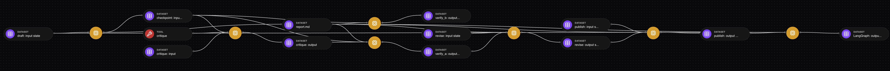
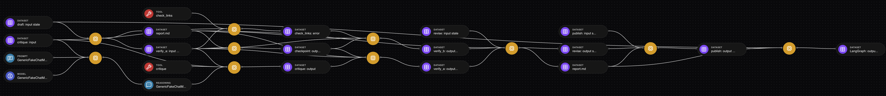

# eqty-lineage-langchain

EQTY lineage callback handler for LangChain and LangGraph. Registers graph nodes, chat model calls, and tool calls as
EQTY data assets and computation statements, threaded together into one end-to-end lineage flow:

- every graph node run → input/output Dataset assets + a computation statement
- every chat model call → Prompt + Model assets in, Reasoning asset out + computation
- every tool call → Tool + input Dataset in, output Dataset out + computation
- every retrieval → Tool + query Prompt in, one Document asset per retrieved document out
- every subagent → its own `agent` computation, linked to the tool that delegated to it

## Usage

```python
from eqty_lineage.langchain import EqtyCallbackHandler

app.invoke(state, config={"callbacks": [EqtyCallbackHandler()]})
```

Only `langchain-core` is required at runtime, so the handler works with plain LangChain runnables as well as LangGraph
graphs. Use one handler instance per invocation.

## `verbose` — extra metadata on assets

```python
EqtyCallbackHandler(verbose=True)
```

By default each asset carries only its name and description. With `verbose=True`, every registered asset also gets the
raw LangChain callback context as metadata: which callback produced it (`callback`), the `run_id` and `parent_run_id`,
`tags`, the LangGraph `metadata` dict, and any other keyword arguments the callback received.

Values are sanitized before they reach the SDK so they render correctly in the graph explorer (which displays each
metadata value as a string):

- non-JSON types (`UUID`, `Path`, messages, ...) are converted to strings automatically — no need to pre-stringify `run_id`
- dicts and lists are JSON-encoded (otherwise they'd display as  `[object Object]`)
- `None` is kept and encoded as the string `"null"`, so a present-but-empty key is distinguishable from an absent one
- keys that collide with the SDK's own constructor kwargs (`name`, `description`, ...) are prefixed with `LC-`
(e.g. the LangChain run name appears as `LC-name`)

## `@eqty_tool` — capture tool source code

```python
from langchain_core.tools import tool
from eqty_lineage.langchain import eqty_tool


@tool
@eqty_tool
def search(query: str) -> str:
    """Search the knowledge base."""
    ...
```

Decorating a tool function with `@eqty_tool` records its Python source code at definition time (callbacks only receive
the tool's *name* at runtime, so the source cannot be recovered later). When the tool is first called, the handler
registers its Tool asset **from the source code itself** — mirroring how `@eqty_sdk.compute` registers a code asset for
the function it wraps — so the asset's CID is content-addressed to the implementation: edit the tool's code and the
next run produces a new Tool asset, making it visible in the lineage which version of the code each computation used.

Notes:

- the decorator returns the function unchanged and works on either side of LangChain's `@tool`
- tools without the decorator still get a Tool asset, registered from a name/description stub instead of source
- source capture uses `inspect.getsource`, so it only works for functions defined in real files
(not a REPL or `exec`'d code); the tool's registered source includes its decorator lines
- the registry is module-level state, so a handler imported as a separate module object has its own copy —
`examples/langchain/diff_demo.py` registers its tools against whichever handler module it is about to run,
rather than decorating them once at import time

## What lands on each computation

Every computation statement carries a `framework` tag, read from the run's own metadata rather than assumed:
LangSmith's `ls_integration` when the harness sets it (`deepagents`, `langchain_create_agent`), `langgraph` when the run
carries `langgraph_*` metadata, and `langchain` otherwise. The root computation is named after the agent's
`lc_agent_name` when there is one, so a named agent no longer shows up as `LangGraph`.

Failures are recorded rather than dropped. A node, tool or model call that raises produces a computation with
`computation_type` of `graph_node_error`, `tool_error` or `chat_model_error` and a Dataset output holding the error type
and message. A failed tool's error also feeds the enclosing node's output state, because that is what the model sees.

Work nested inside a tool — a model call, another chain — is linked to the tool's result, and a node that returns `None`
(as LangChain middleware does to mean "no state update") is still recorded, scoped to that node so unrelated middleware
nodes do not collapse onto one shared entity.

LangGraph `Command` results are unwrapped rather than stringified, so the state update a tool applied — including files a
DeepAgents subagent wrote via `task` — stays structured and its `Path` values are still collected.

## Subagents

A subagent's root run carries its own name but inherits `langgraph_node` from the tool that spawned it, so it matches
neither the node rule nor the root rule. It is detected instead by its `lc_agent_name` differing from its parent's —
LangChain's own rule, from `langchain.agents._subagent_transformer` — and recorded with `computation_type` of `agent`.
Its final state feeds the tool that delegated to it, so DeepAgents' `task` no longer appears to produce its result from
nothing. A plain subgraph inherits the parent's name and is not a boundary.

## Retrievals

`on_retriever_start` / `on_retriever_end` register the retriever as a `Tool`, the query as a `Prompt`, and **each
retrieved document as its own `Document` asset** — one per document rather than one per result set, so the same
document retrieved by two different queries is recognisably the same entity. Each document asset carries the
document's own `metadata`, which is where per-document provenance normally lives (`source`, page, chunk id), and is
named from `metadata["source"]` when present. For a RAG chain this is the provenance that matters most.

The retriever's own asset is content-addressed to its **identity**, not just its class name — a class name alone
cannot tell two corpora apart. Whatever you attach with `with_config` is folded in:

```python
retriever.with_config(run_name="legal-index", metadata={"index": "pinecone://legal-v3"})
```

- `retriever` — what this run called it (`run_name` when set, otherwise the class)
- `class` — from LangSmith's `ls_retriever_name`, stable even when `run_name` renames the run
- `config` — the metadata you attached, minus the frameworks' own run-scoped keys (`langgraph_*`, `ls_*`, `lc_*`,
`checkpoint_ns`), which would otherwise mint a new asset on every call
- `tags` — any tags you attached

So the same wrapper class aimed at two indexes registers as two assets, and the manifest records *which* corpus was
consulted. Nothing is required: an un-configured retriever still gets an asset, just a less specific one.

## `StateExtractor` — teaching the handler about your state

```python
from eqty_lineage.langchain import UNCLAIMED, EqtyCallbackHandler, StateExtractor


class FilesExtractor(StateExtractor):
    def extract(self, key_path, value, sink):
        if key_path != ("files",):
            return UNCLAIMED
        for path, data in value.items():
            asset = Dataset.from_object(data, name=path, **sink.metadata)
            sink.create(asset.cid)
        return {"extracted": sorted(value)}


handler = EqtyCallbackHandler()
handler.add_extractor(FilesExtractor())
```

By default everything a state holds is serialized into that node's state Dataset, every time — so a filesystem carried
in state is embedded once per node, and no file is ever an entity in its own right. An extractor claims part of a
state, registers whatever assets represent it, and returns what stands in its place in the payload.

- `key_path` is the sequence of dict keys that led to the value, so an extractor claims a particular state key rather
than guessing from the value's shape
- `sink.carry(cid)` for an entity that already existed (an input); `sink.create(cid)` for one this computation produced
(an output). Never both — re-emitting a carried asset as an output puts a cycle in the graph
- `sink.metadata` is the sanitized verbose metadata, ready to unpack into an SDK asset constructor
- extractors are consulted in registration order, newest first, so yours beats the built-in `PathExtractor`
- an extractor that raises is skipped rather than taking down the run being observed

## `Path` values in graph state

`pathlib.Path` values in graph state get special treatment: if the path exists, the file or directory is registered as
its own Dataset asset via `Dataset.from_path` (CIDing full directory contents) and linked into the computation that
carried it. Keep filesystem references in state as `Path` objects rather than strings to opt in.

Versions are keyed on `(path, content CID)`, not on the path alone, so a file rewritten partway through a run is a
distinct entity from the one registered earlier:

- **new content at a known path** — a new Dataset asset, recorded as an *output* of the computation that wrote it, with
  the version it replaced linked as an *input*. Successive edits form a chain rather than unrelated assets.
- **content already registered** — carried through as an *input*, never re-emitted as an output (which would put a cycle
  in the graph).

Keying on the path alone would resolve every later sighting to the first one's asset, so any computation running after a
rewrite would be attested against content it never saw.

## Demo: what the lineage looks like before and after

```bash
just langchain-diff-demo                                 # working tree vs. the newest release tag
just langchain-diff-demo eqty-lineage-langchain@0.0.1    # ...or any ref you name
```

Runs one identical document-review agent twice — once through the handler at the baseline ref, once through
the working tree — and writes `manifests/before.json` and `manifests/after.json`. The model is scripted rather
than live, so the two runs are byte-identical and every difference in the manifest is attributable to the
handler alone.

The baseline defaults to the newest `eqty-lineage-langchain@*` tag, so this keeps answering "what changed
since the last release" as releases are cut, rather than freezing into a comparison against one fixed version.
Rows that differ are marked `*`; a run against an unchanged baseline marks nothing.

Every row is a property of the lineage and is stable run to run. The manifest's raw statement and asset
counts are deliberately not reported: assets are content-addressed, so two state payloads that happen to
coincide collapse into one registration and the totals move by one between otherwise identical runs.

Because the baseline tracks the newest tag, the table changes as releases are cut. Against `0.0.2` it shows
what the coverage work added — subagents, retrievals, and the last orphaned output:

| | before (0.0.2) | after |
| --- | --- | --- |
| computations recorded | 14 | 16 |
| retrievals recorded | 0 | 1 |
| documents registered | 0 | 2 |
| subagents recorded | none | `specialist` |
| computation kinds | `chat_model`, `graph`, `graph_node`, `tool`, `tool_error` | plus `agent`, `retriever` |
| orphaned node outputs | `assess` | none |

Rows fixed in an earlier release are unmarked, because both sides now agree on them. Reaching further back
shows the correctness work instead:

```bash
just langchain-diff-demo eqty-lineage-langchain@0.0.1
```

| | before (0.0.1) | after |
| --- | --- | --- |
| exceptions swallowed by LangChain | `KeyError('state_in')`, `TypeError(... NoneType)` | none |
| computations recorded | 11 | 16 |
| graph nodes present | `checkpoint` missing | all nine |
| orphaned node outputs | `verify_b`, `assess` | none |
| `report.md` versions tracked | 1 | 2 |
| `publish` linked to the bytes it read | **no** | yes |

In the graph explorer, that `0.0.1` comparison looks like this. (The screenshots predate the retrieval and
subagent steps, so they show the earlier, smaller graph.)

Before — only `Dataset` and `Tool` assets, one red tool wrench, and `verify_b`'s output going nowhere:



After — `Prompt`, `Model` and `Reasoning` appear on the left (the model call that was being dropped), a
second tool wrench for the tool that fails, and both parallel branches feeding the next node:


